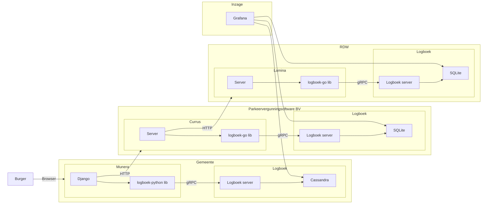

# Logboek dataverwerkingen demo

Een demo hoe de standaard Logboek dataverwerkingen ingezet kan worden.

## Deze standaard is in ontwikkeling

- De laatste ontwikkelingen staan in de - branch [develop](https://github.com/Logius-standaarden/logboek-dataverwerkingen/tree/develop)
- De laatste versie van de standaard online lezen - [ReSpec publicatie](https://logius-standaarden.github.io/logboek-dataverwerkingen/)
- Meedoen aan de discussie en ontwikkeling kan via - [Mattermost Digilab omgeving](https://digilab.overheid.nl/chat/verwerkingenlogging)
- vragen kunnen worden gemailed aan [api@logius.nl](mailto:api@logius.nl) of als issue worden ingebracht [via deze link](https://github.com/Logius-standaarden/logboek-dataverwerkingen/issues)

## Componenten

Deze demo bestaat uit de volgede componenten (te vinden in de `apps` directory):

- **[munera](./apps/munera)**: een fictive Mijn Gemeente-omgeving waar burgers gemeentezaken kunnen regelen;
- **[currus](./apps/currus)**: een API voor het beheren van parkeervergunningen;
- **[lamina](./apps/lamina)**: een API voor het beschiknbaar stellen van registratiegegevens van voertuigen.


## Gebruik

Voor het starten van de demo zijn [Docker](https://docs.docker.com/get-docker/) en [Docker Compose](https://docs.docker.com/compose/install/) nodig.

1. Maak een kopie van deze repository:
    ```sh
    git clone https://github.com/MinBZK/logboek-dataverwerkingen-demo.git

    cd logboek-dataverwerkingen-demo
    ```

1. Start de demo:
    ```sh
    make start
    ```

1. Navigeer naar <http://localhost:8080/>. Aanmelden kan met de gebruikersnaam `burger` en wachtwoord `demo123`.

1. Bekijk de logboeken via <http://localhost:3000>.


## Architectuur


## Overzicht

De Logboek Dataverwerkingen (LDV) standaard bestaat uit de volgende drie documenten:

| Beschrijving van het document           | Gepubliceerde versie                  | Werk versie                             | Repository                                                   |
| --------------------------------------- | ------------------------------------- | --------------------------------------- | ------------------------------------------------------------ |
| 1. De LDV Normatieve Standaard | - | [Logboek dataverwerkingen (werkversie)](https://logius-standaarden.github.io/logboek-dataverwerkingen/) | [logboek-dataverwerkingen](https://github.com/Logius-standaarden/logboek-dataverwerkingen) |
| 2. De Algemene Inleiding | - | [De Algemene Inleiding (werkversie)](https://logius-standaarden.github.io/publicatie/api/Logboek_Algemeen/)|[logboek-dataverwerkingen_Inleiding](https://github.com/Logius-standaarden/logboek-dataverwerkingen_Inleiding)|
| 3. het Juridische Beleidskader | - |[Juridisch Beleidskader (werkversie)](https://logius-standaarden.github.io/publicatie/api/Logboek_Juridisch/)|[logboek-dataverwerkingen_Juridisch-beleidskader](https://github.com/Logius-standaarden/logboek-dataverwerkingen_Juridisch-beleidskader/)|
| 4. LDV Extensie voor objecten | - |[Onderzoek logboek dataverwerkingen voor (geo) objecten](https://geonovum.github.io/logboek-dataverwerkingen-voor-objecten/)|[logboek-dataverwerkingen-voor-objecten](https://github.com/geonovum/logboek-dataverwerkingen-voor-objecten/)|


## License

Licensed under EUPL v1.2
